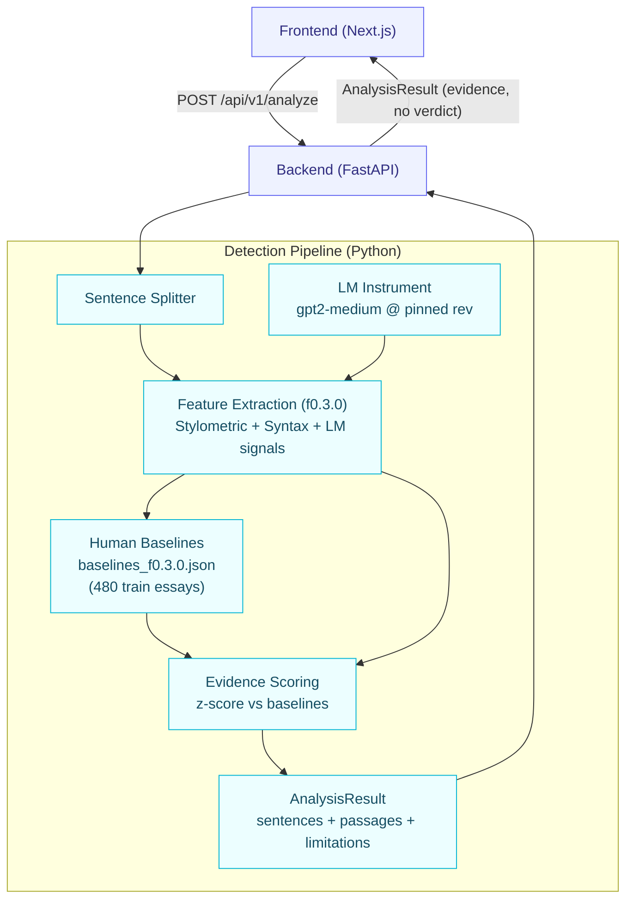

# AI Essay Detector

**Evidence-based AI-writing analysis for college admissions essays** — sentence/passage-level evidence, honest evaluation, documented limitations. Built for Project 2 of the 2026 i12 HR Drive Hackathon (Callus).

GPT-2 Medium is used **only as an instrument** to produce measurable signals (perplexity, entropy, token probabilities, rank). It never renders an authorship verdict. Detection comes from our own feature extraction + baselines + evidence pipeline. See `AGENTS.md` for the non-negotiable detector principles and `docs/` for architecture, ADRs, and methodology.

---

Paste an admissions essay → get **sentence-level evidence** showing which measured features deviate from human baselines, with honest limitations. No "AI probability" — only measurable signals.

The evidence pipeline is live end-to-end: feature extraction (`f0.3.0`), human baselines (`v0.1.0`), `/api/v1/analyze`, and the frontend are all implemented and tested (200+ tests, ruff + mypy clean). The classifier and AI-generated training set are later phases.

---

## Quick Start

### Backend (FastAPI)

```powershell
cd backend
python -m venv .venv
.\.venv\Scripts\Activate.ps1
pip install -r requirements.txt
# optional: copy .env.example to .env and adjust
uvicorn app.main:app --reload
```

- Health: `GET http://127.0.0.1:8000/api/v1/health`
- Analyze: `POST http://127.0.0.1:8000/api/v1/analyze` with `{"text": "..."}`

### Frontend (Next.js 16)

```powershell
cd frontend
npm install
npm run dev
```

Open `http://localhost:3000` — paste an essay, click **Analyze**.

---

## API Contract

### `POST /api/v1/analyze`

**Request**
```json
{
  "text": "Your admissions essay here..."
}
```

**Response** (`AnalysisResult`)
```json
{
  "analysis_id": "uuid",
  "timestamp": "2026-08-15T...",
  "feature_version": "f0.3.0",
  "model_version": "0.1.0",
  "baselines_version": "1.0",
  "dataset_version": "v0.1.0",
  "essay_word_count": 420,
  "essay_token_count": 512,
  "length_bucket": "standard",
  "baseline_bucket": "standard",
  "summary": {
    "sentence_count": 12,
    "signal_sentences": 3,
    "high": 1,
    "medium": 2,
    "low": 8,
    "uncertain": 1
  },
  "sentences": [
    {
      "index": 0,
      "text": "Every summer I return...",
      "signals": [
        {
          "feature": "perplexity",
          "value": 42.3,
          "baseline_mean": 24.7,
          "baseline_std": 18.2,
          "z_score": 0.97,
          "direction": "higher",
          "evidence": "low",
          "summary": "perplexity: 42.30 (human baseline: 24.70 ± 18.20) — within the typical human baseline range"
        }
      ],
      "signal_count": 0,
      "evidence_strength": "low",
      "summary": "sentence 0: all 40 scored features fall within the typical human baseline range"
    }
  ],
  "passages": [...],
  "limitations": [
    "This analysis measures machine-like writing signals using statistical and language-model measurements; it is evidence, not a claim of authorship.",
    "The language model is an instrument for measurable token signals only; it never judges whether text was written by an AI.",
    "Human baselines come from the training split of dataset v0.1.0 (480 human admissions essays); behavior on other populations is unknown and may differ.",
    "Features without a baseline distribution are not scored; evidence covers only features comparable to the human sample.",
    "Short, heavily edited, or second-language essays can produce unusual signals for reasons unrelated to AI writing."
  ]
}
```

### Evidence Strength Levels
| Level | Meaning |
|-------|---------|
| `high` | One or more features ≥ 2σ from human baseline |
| `medium` | One or more features ≥ 1σ (and none ≥ 2σ) |
| `low` | All scored features within 1σ of baseline |
| `uncertain` | No comparable baseline for this feature/bucket |

---

## Frontend UI

The evidence-first interface shows:

1. **Summary card** — "Machine-like signals detected in X of Y sentences" with breakdown (high/medium/low/uncertain)
2. **Sentence list** — Each sentence highlighted by evidence strength (neutral colors: blue=low, amber=medium, orange=high, purple=uncertain). Tap to expand and see the top deviating signals with actual values vs. human baselines.
3. **Limitations panel** — Prominent amber notice listing all documented limitations.

### Screenshots


#### 1. Home page — essay input


#### 2. Analysis results — summary + sentence highlights


#### 3. Expanded sentence — signal table (feature, measured value, baseline, z-score)


#### 4. Limitations notice


---


---

## Architecture Overview



*Rendered as an image by GitHub. To regenerate it, view this file in the GitHub web UI or a Mermaid-enabled editor (mermaid.live).*

### Key Principles (from `AGENTS.md`)
1. **Evidence Over Verdicts** — Never present AI authorship as proven fact
2. **No Opaque LLM Judgement** — LM provides measurable signals only; our software makes the assessment
3. **Sentence & Passage Level** — Every flag has sentence/passage evidence
4. **Every Flag Has Evidence** — UI explains signals (perplexity, entropy, sentence-length regularity, etc.)
5. **Dataset Provenance** — Every source documented with model, prompt, config, date
6. **No Data Leakage** — Splits at document level, never sentence level
7. **Honest Evaluation** — Precision/Recall/F1, confusion matrix, calibration, failure cases
8. **Bias Investigation** — ESL, formal, edited, short, unusual topics audited
9. **Reproducibility** — Dataset/feature/model versions, seeds, configs recorded
10. **Documentation Is Part of the Product** — Reviewer can understand what, why, how, data, evaluation, failures, uncertainties

---

## Dataset & Baselines

| Split | Essays | Source |
|-------|--------|--------|
| Train | 4,230 | VIORRA (128) + LEAF (4,917) + Ghostbuster-human (994) |
| Val | 905 | Same sources, stratified |
| Test | 904 | Same sources, stratified |

**Dedup**: SHA-256 exact (0 removed). **Baselines**: computed on train split only, bucketed by essay length (short <200, standard 200-500, long 500-800, xlong >800 words), min 30 sentence samples per bucket with adjacent-bucket merge fallback. Artifact: `backend/data/baselines/v0.1.0/baselines_f0.3.0.json`.

---

## Running Tests

```powershell
cd backend
.\.venv\Scripts\python.exe -m pytest          # 200+ tests
.\.venv\Scripts\ruff.exe check app tests      # lint
.\.venv\Scripts\mypy.exe app                  # typecheck
```

```powershell
cd frontend
npm run lint          # eslint
npm run build         # typecheck + build
```

---

## Documentation

| File | Purpose |
|------|---------|
| `docs/HOW_IT_WORKS.md` | **Complete walkthrough**: what, why, how, data, evaluation, failures |
| `docs/ARCHITECTURE.md` | System design, data flow, ADR summary, versioning |
| `docs/DECISIONS.md` | ADR-001 through ADR-009 (full records) |
| `docs/METHODOLOGY.md` | Detection methodology, feature families, evidence generation |
| `docs/DATASET.md` | Source registry, provenance, licensing, preprocessing |
| `docs/EXPERIMENTS.md` | Experiment log (hypothesis, config, dataset, result, conclusion) |
| `docs/EVALUATION.md` | Metrics, test sets, calibration, bias audit, failure cases |
| `docs/LIMITATIONS.md` | Documented limitations and known gaps |
| `docs/FAILURE-CASES.md` | Three confident incorrect predictions with analysis |
| `docs/QUALITY-STANDARDS.md` | Software engineering quality gate |
| `docs/SKILLS.md` | Project-specific skill definitions |
| `AGENTS.md` | Root control layer — non-negotiable principles, rules, agent roles |

---

## Git Hygiene

Never commit: `.env`, model weights, datasets, `node_modules/`, `.next/`, `.venv/`, `backend/data/cache/`.  
Commits use Conventional Commits format (`feat:`, `fix:`, `docs:`, `refactor:`, `test:`, `chore:`).
